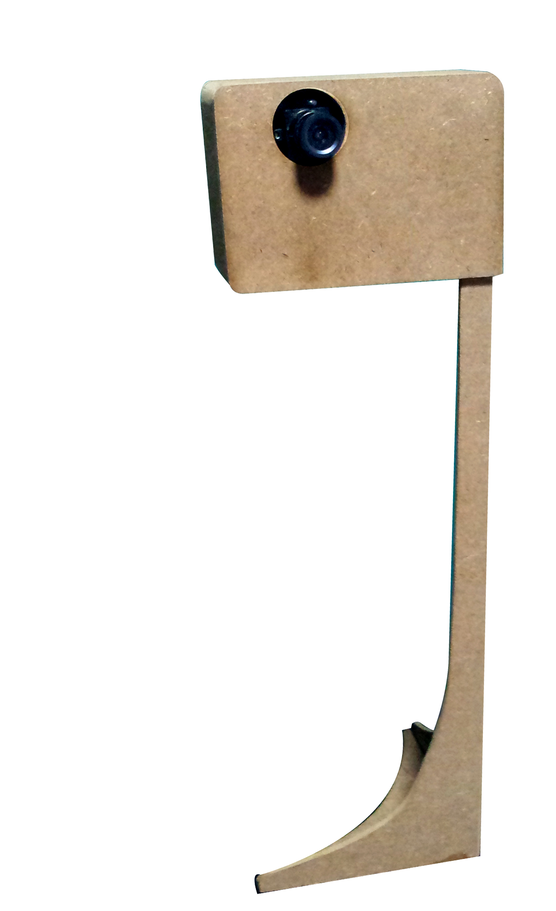

## Catch - Using the mouth as a game controller

<video width="500" height="300" controls="controls">
  <source src="https://gxite.github.io/portfolio/video/catch_mouse.mp4" type="video/mp4" >
</video>

*The source code can be found [here](https://github.com/gxite/catch_v1).* 
*This version has been modified to be operated with a mouse.*

This is an exploration into how the mouth can be used to interact with a computer. I had made a simple game in Processing where the objective is to score as many points as possible by using a cursor to collect "green coloured spheres" within a minute. The cursor is controlled by tracking the location of the mouth, using the opening and closing of the mouth to substitute a mouse click. 

Tracking was enabled using a Pixy camera and Arduino. The Pixy is built with the capability to track multiple coloured objects. An Arduino is used to process the detection outputs from the Pixy camera and subsequently fed the processed outputs to Processing via a serial port. 

The camera tracks 2 neon cylinders that are positioned on the top and bottom lip of the mouth. The length of the cylinders are used to uniquely identify the Top and Bottom lips. A threshold distance between the 2 cylinders is used to trigger a mouse click.

## After thoughts

Future iterations of this concept can potentially be enabled using OpenCV and open-sourced facial contour models. It might be interesting to explore means to deploy it on the web. 

October 2019

