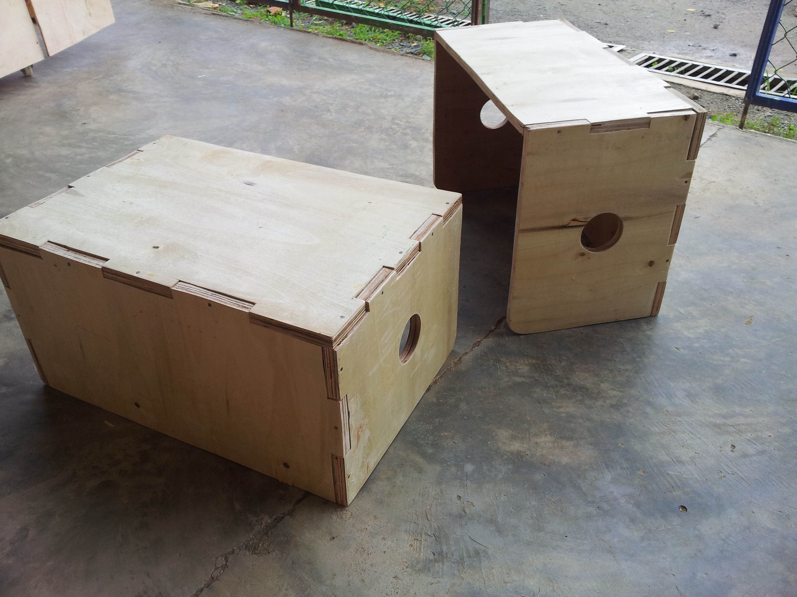
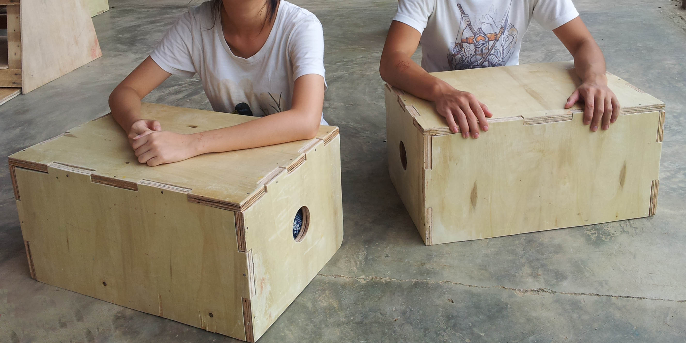
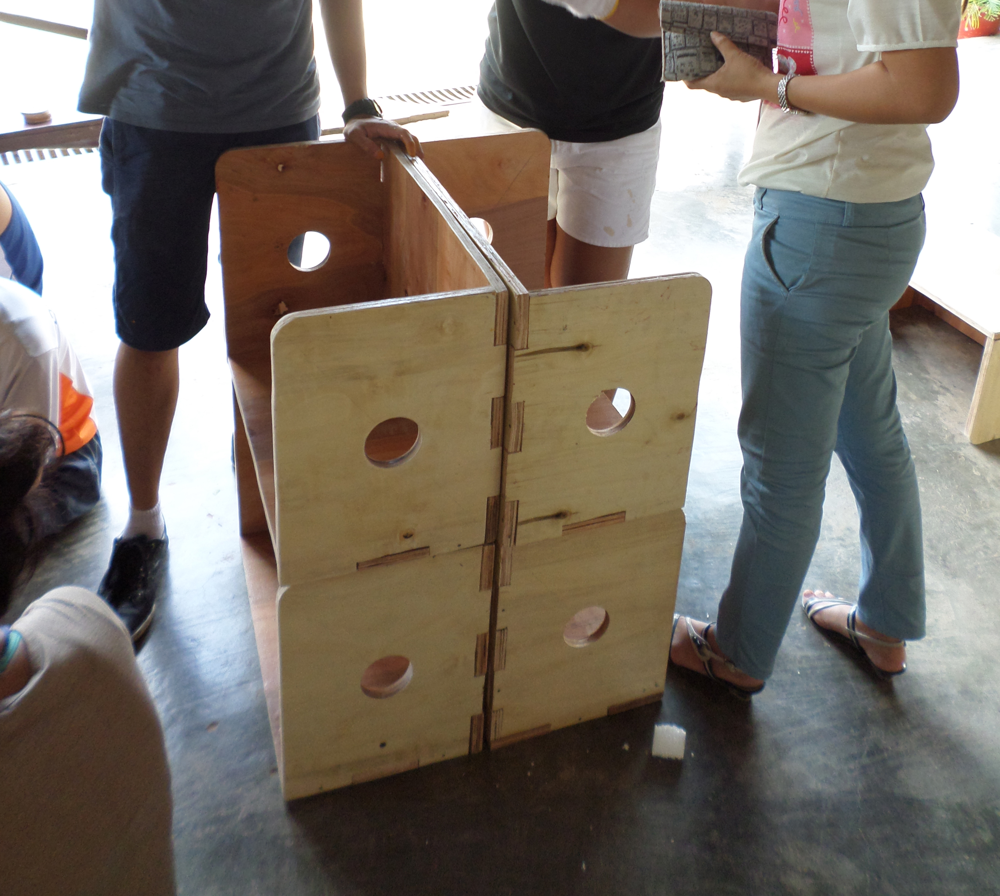
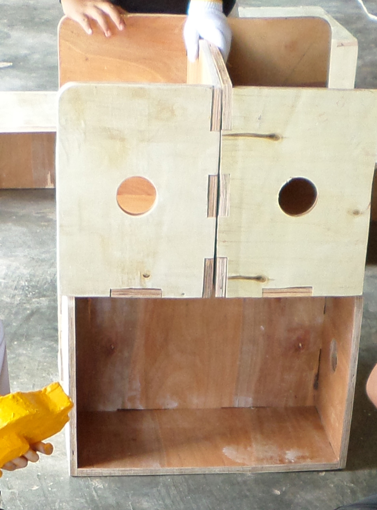

## Flip! - Multi-configuration furniture for pre-schools

Flip! is a simple furniture that is designed to serve multiple functions at a pre-school. This project was part of a service learning initiative between Pour un Sourire d’Enfant’s (PSE) Cambodia and the NUS Department of Architecture back in 2014. 

Flip! is primarily designed as a floor desk for young children. By flipping the desk on its side, it becomes a stool that is comfortable for adults. By stacking multiple units together, they can function as shelves and makeshift classroom dividers. A circular hand hold is on the sides made it easier for each unit to be moved. All edges are sanded down and rounded to ensure that there are no sharp edges. 

The design is intended to be simple and to be fabricated out of any planar materials using simple power tools. There are only 3 unique panel shapes to the whole design. This iteration is fabricated out of 3/4 inch plywood and reinforced with nails along the finger joint. 

## After thoughts

Additional holes can be added to the sides of the desk to enable the stacked configuration to be better secured. As it is now, the stacked configuration poses a hazard to young children. On hind sight,  1/2 inch plywood would have been more than sufficient. This would make each unit lighter and easier to handle as well.

Future iterations could explore more reliable means to assemble 

October 2019