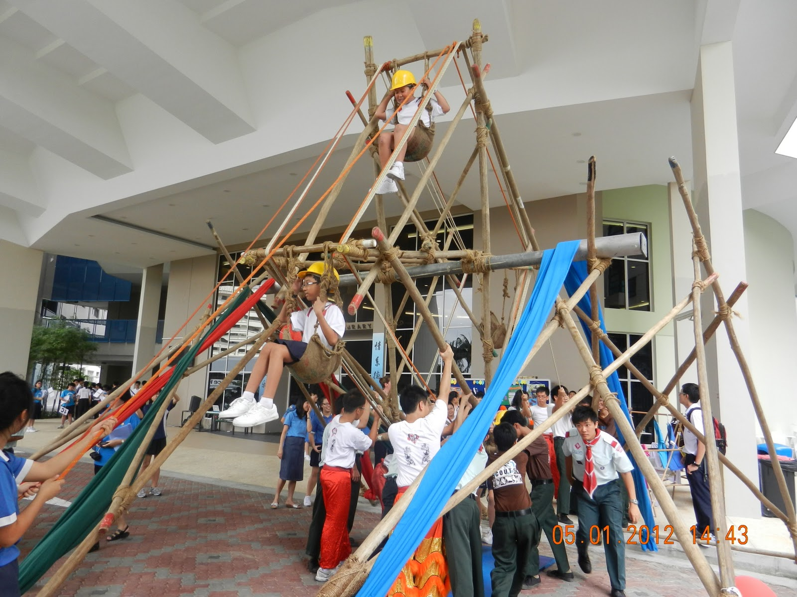
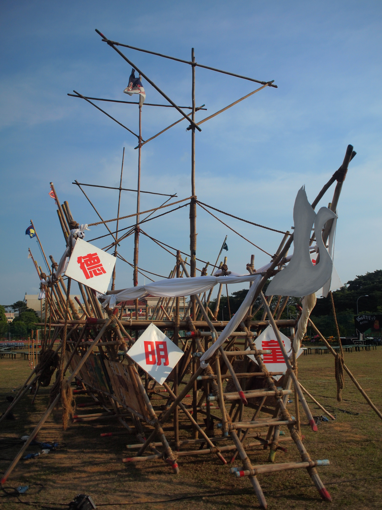
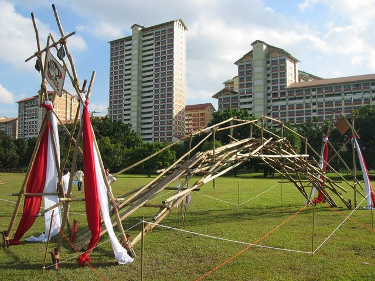
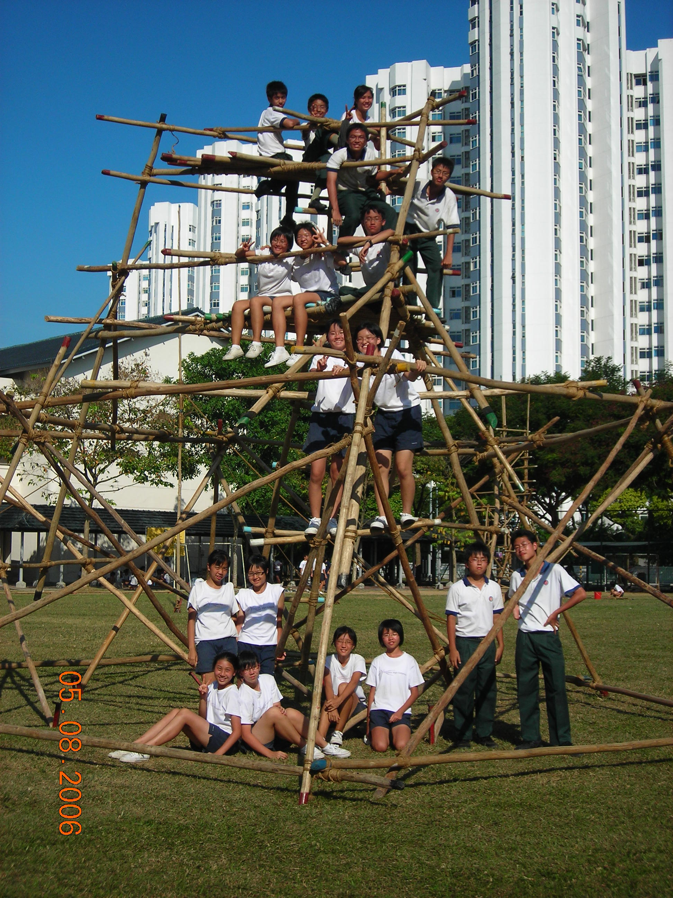

## Miscallaneous Scouts Pioneering Projects - DHS Crane Scouts

I had been active with my school's scouts troop from 2004 to 2016. Over the years, I have had opportunities to design and build large structures. These are a collection of past pioneering projects that I was the lead designer for.

## Ferris Wheel - 2012

We were inspired by ferris wheel projects that had found on the web and had decided to make one ourselves. While we have built many large static structures in the past, none of us had experience in making anything that incorporated a large moving component. 

One of the central challenges that we had was to find an axle that can withstand the huge loads. The references that we had found online had access to relatively large diameter logs, which we did not have. It was also not feasible to source for logs of that size and length in Singapore. We were lucky to find a contact at a construction firm that was kind enough to 
sponsor a cylindrical steel column, which we had utilized as the main axle for the wheel. The axle sits within a PVC housing, which helps to minimize friction and avoids wearing out the logs from direct contact.

The 2 supports for the main axle were 'A' shaped frames that can be adjusted to span wider or closer. This effectively allows the height of the axle to be adjusted. Once the supports and axle was in place, we began building the wheel around the axle, one wheel spoke at a time. The first spoke would rest vertically on the ground while it was secured and braced. When the spoke was completed, we would lift the axle up vertically by adjusting the span of the A frames. This would allow us to rotate the half-completed wheel by 90 degrees, to position it in place for the installation of the next wheel spoke. 

The completed wheel was strong enough to take on 4 passengers. The rotation relied on good old manpower and controlled with a series of ropes. Overall, this project was technically challenging but remains one of the funnest builds that we did.

## Ship-themed Gateway - 2011

This was a big but relatively straight forward and primarily stylistic build. It was a ship-themed gateway with a deck that allows guests to walk along the length of the ship. It was primarily designed for photo ops.

## Arch Bridge - 2007

This was another challenging build. The goal was to build an arch bridge out of straight logs that could span 12 meters. We were inspired by a NOVA documentary about recreating a Song Dynasty "Rainbow Bridge". 

The key principle that we had to figure out was the mechanism for a friction lock bridge and how we would size it up such that we can span 12 meters. We ended up fabricating the bridge in 2 structural halves. These are fabricated on the ground and braced for rigidity. Each half is then positioned on opposite side of the banks with large metal stakes serving as abutments. The front of each half is then hoisted up with the abutments serving as pivots. The front of the 2 halves are gradually lowered until they come into a lock position with each other, forming the arch. The hand holds and decking are then added.

The completed bridge was remarkably stable and can easily hold the weight of the whole team. One drawback was that the gradient up the arch was a little steep and made it hard for people to walk up. But overall, we were quite pleased with how the bridge held up.

## Incomplete tower base - 2006

This was one of my early experiments. The goal was to build a hexagonal tower that is supported only be a rigid frame around the perimeter, with no columns or bracings in the core area. I got a little too ambitious and made the base a tad bit too big. Additional complications arised from lashings that were not strong enough due to our inexperience. In the end, we ran out of time and we had to settle for a partially completed tower base.

November 2019
